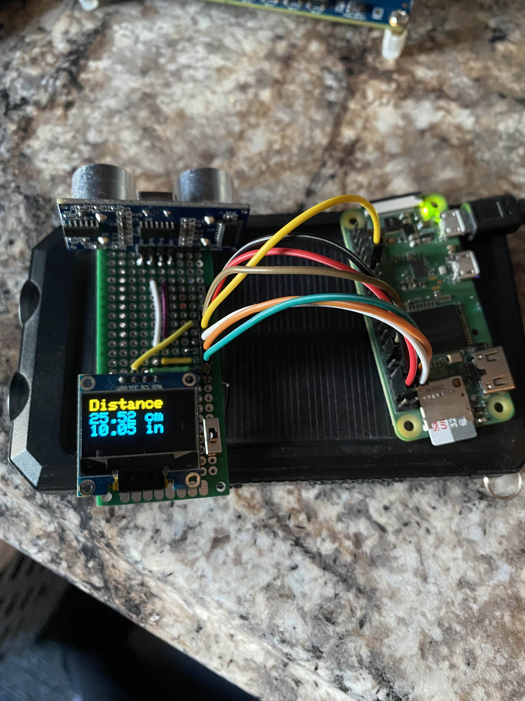

# Ultrasonic-Rangefinder
Developers: Siddhartha Bajracharya and Joshua Wilbur
A short distance ultrasonic rangefinder utilizing a Raspberry Pi 0 and HC-SR04 sensor. Distances from roughly 3cm to 400cm can be measured. A SSD1306 display is used to output readings. Credit to Ilia Penev for the ssd1306.c driver file. A schematic of this design can be found at docs/Rangefinder_schematic.pdf.

https://github.com/iliapenev/ssd1306_i2c

# TODO
* Benchmark and record results in a table
* Demo video